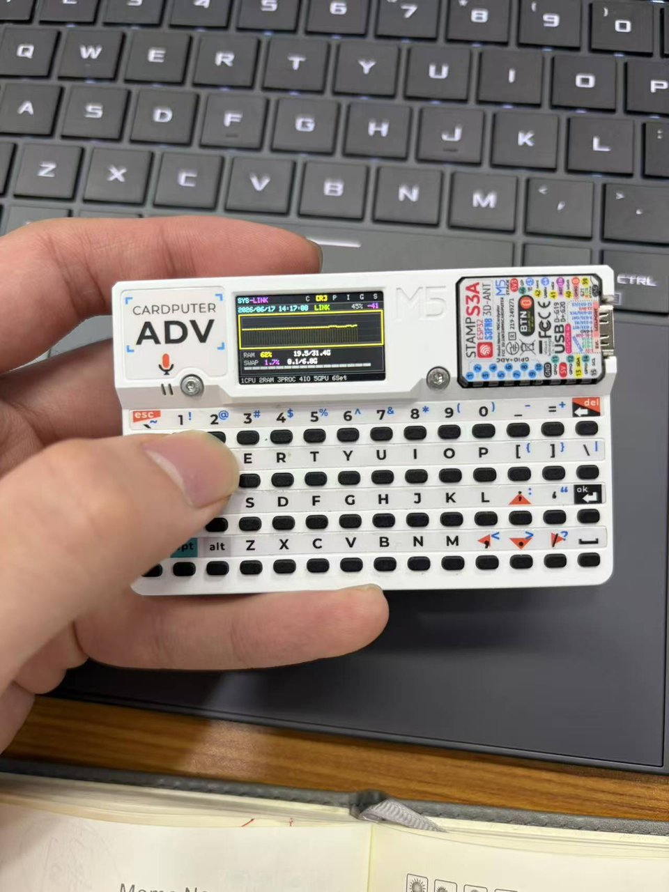
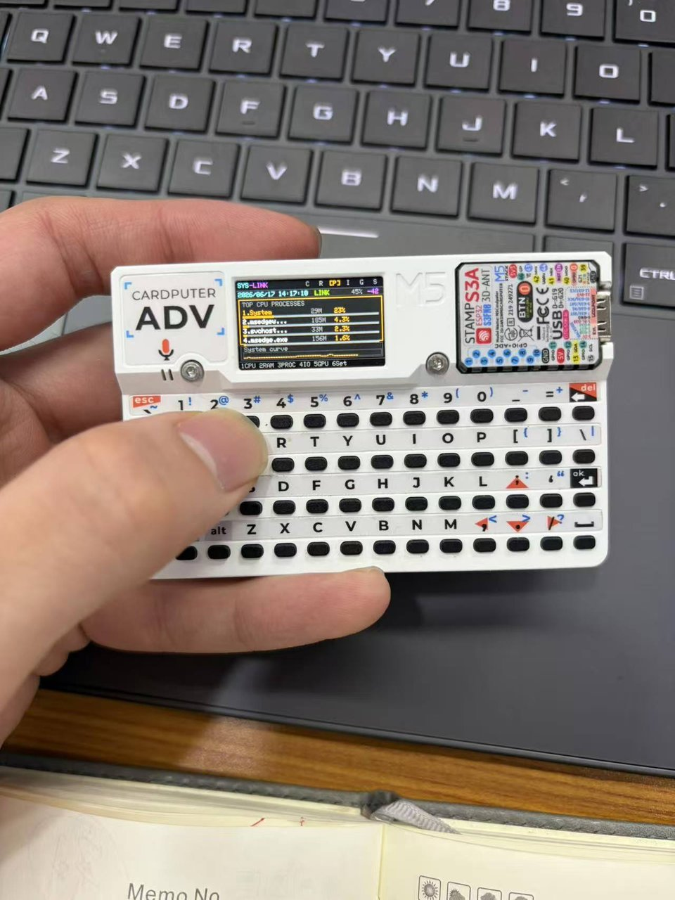
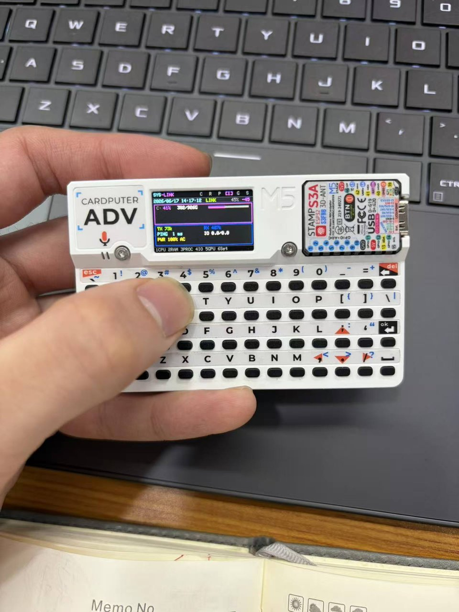
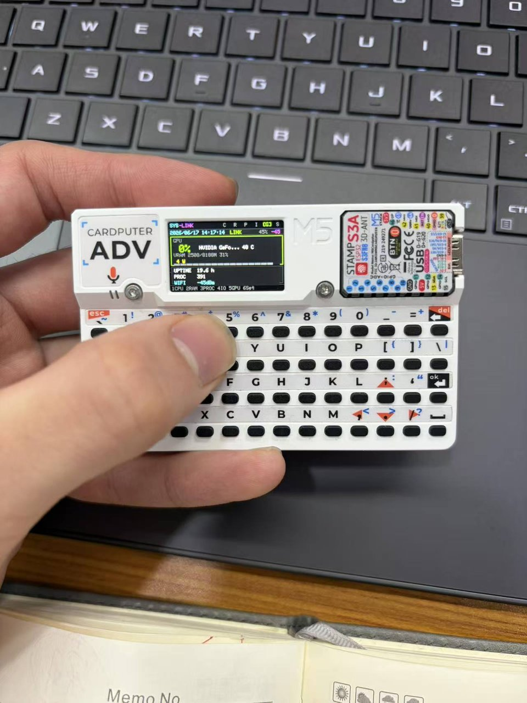

# M5Stack Cardputer Adv — Windows PC Wi-Fi System Monitor v3

[中文](README.md) | **English**

Monitor your **Windows PC** from an **M5Stack Cardputer Adv** over Wi-Fi. v3 ships a **6-page sci-fi HUD** with CPU/RAM/process sparklines, Top 5 processes, multi-drive storage, Swap, Ping, and optional GPU power draw.

> Classic 4-page build: [cardputer-pc-monitor (v2)](https://github.com/wangyu123554/cardputer-pc-monitor)

<p align="center">
  
  
  
</p>
<p align="center">
  
  
  
</p>

---

## What's new in v3

| Area | Details |
|------|---------|
| **6-page HUD** | CPU · RAM · Processes · IO · GPU · Settings (keys 1–6) |
| **Live curves** | Filled sparklines for CPU, RAM, and #1 process CPU |
| **Process view** | Top 5 processes by CPU with memory and bars |
| **Storage / network** | Up to 4 drives, TX/RX speed, Ping, disk I/O |
| **GPU** | Utilization, VRAM, temperature, power (NVIDIA + `nvidia-smi`) |
| **One-click PC setup** | `一键安装.bat` configures firewall, autostart, LHM watchdog |
| **Standalone EXE** | Optional `build_agent_exe.bat` → `PCMonitorAgent.exe` |

---

## Six pages

| Key | Page | Shows |
|:---:|------|-------|
| **1** | **CPU** | CPU curve, usage, peak, frequency, temperature, hostname |
| **2** | **RAM** | RAM curve, used/total, Swap usage |
| **3** | **PROC** | Top 5 CPU processes + #1 process CPU curve |
| **4** | **IO** | Multi-drive space, upload/download, Ping, disk I/O, laptop battery |
| **5** | **GPU** | GPU load, VRAM, temperature, power, uptime |
| **6** | **Set** | Wi-Fi / Agent IP / setup portal info |

**Other keys:** `R` refresh settings · `Del` / `Esc` back to CPU page

**Status bar:** date/time · `LINK` / `DOWN` / `SLOW` · Cardputer battery · Wi-Fi RSSI

---

## Requirements

| Component | Required |
|-----------|:--------:|
| M5Stack **Cardputer Adv** | ✓ |
| Windows 10/11 PC on same LAN | ✓ |
| Python 3.10+ (or Release EXE) | ✓ |
| VS Code + PlatformIO (flash firmware) | ✓ |
| LibreHardwareMonitor | Optional (CPU temp) |
| NVIDIA GPU + drivers | Optional (GPU page) |

---

## Quick start

### Option A — Release zip (PC users)

1. Download **PC-Agent-v3.zip** from [Releases](https://github.com/wangyu123554/cardputer-pc-monitor-v3/releases)
2. Extract and **Run as administrator** → `一键安装.bat`
3. Note the **LAN IP** printed by the script

### Option B — Full repo (firmware + agent)

```bat
git clone https://github.com/wangyu123554/cardputer-pc-monitor-v3.git
cd cardputer-pc-monitor-v3
```

**PC:** Run `一键安装.bat` as administrator  
**Firmware:** VS Code + PlatformIO → env `m5stack-cardputer` → Upload

### Cardputer setup

1. Join Wi-Fi hotspot **`PCMonitor-Setup`**
2. Open **http://192.168.4.1**
3. Enter Wi-Fi credentials + PC **Agent IP** + port **8765**

**PC check:** `http://127.0.0.1:8765/stats` should return JSON

---

## Architecture

```
Cardputer Adv  ──Wi-Fi GET /stats──►  Windows PC Agent (:8765)
                                         ├── psutil (CPU/RAM/disk/net/processes)
                                         ├── LibreHardwareMonitor (CPU temp, optional)
                                         └── nvidia-smi (GPU, optional)
```

The agent samples metrics in background threads. The Cardputer polls every ~2.5 s. Port **8765 is single-instance** — duplicate launches exit immediately.

---

## Agent JSON fields

| Field | Description |
|-------|-------------|
| `cpu` | Usage, core peak, frequency, temperature |
| `ram` | Memory usage + Swap |
| `processes` | Top 5 (name / cpu / mem_mb) |
| `disks` | Up to 4 drive letters |
| `network` | Upload/download kbps, Ping ms |
| `disk_io` | Read/write MB/s |
| `gpu` | Load, VRAM, temperature, power |
| `battery` | Laptop battery (if available) |
| `system` | Uptime, process count |

---

## PC scripts

| Script | Purpose |
|--------|---------|
| **`一键安装.bat`** | Recommended — firewall + autostart + LHM + start now |
| `setup_pc_once.bat` | Same as above |
| `build_agent_exe.bat` | Build standalone EXE (no Python install) |
| `pack_release.bat` | Create distribution zip |
| `restart_agent.bat` | Restart agent (kill port 8765 first) |
| `run_agent.bat` | Debug with console window |
| `uninstall_all.bat` | Remove scheduled tasks |
| `install_lhm_autostart.bat` | LHM + 3-minute watchdog only |

---

## Resource usage (typical)

| Process | RAM | Idle CPU |
|---------|-----|----------|
| Agent (pythonw) | ~35 MB | < 1% |
| LibreHardwareMonitor | ~145 MB | ~0% |

---

## Project layout

```
cardputer-pc-monitor-v3/
├── src/                    # Cardputer Adv firmware (ESP32-S3)
├── platformio.ini
├── pc_monitor_agent.py     # Windows Agent
├── 一键安装.bat
├── setup_pc_once.bat
├── requirements.txt
└── docs/
    ├── TROUBLESHOOTING.md
    └── images/             # Six page screenshots
```

---

## Troubleshooting

See [docs/TROUBLESHOOTING.md](docs/TROUBLESHOOTING.md)

| Symptom | Fix |
|---------|-----|
| Cardputer shows DOWN | Check PC IP, firewall port 8765, run `restart_agent.bat` |
| CPU temp `--` | Install LHM, or wait ~30 s for agent to launch it |
| GPU N/A | Requires NVIDIA GPU and `nvidia-smi` |
| Old agent after upgrade | Run `restart_agent.bat` |

---

## License

MIT — see [LICENSE](LICENSE)
